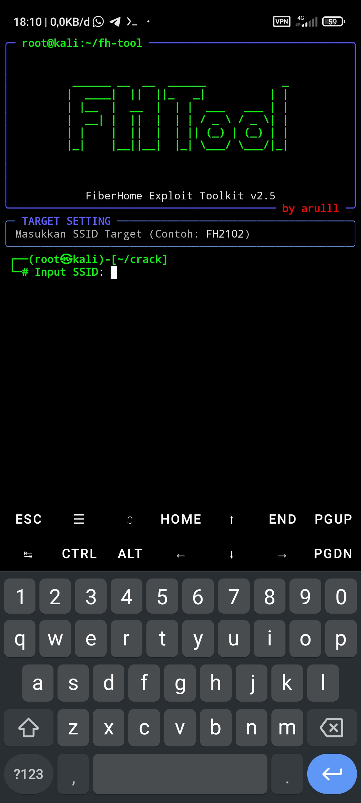

# FH-TOOL (FiberHome Exploit Toolkit)


**FH-TOOL** adalah alat simulasi audit keamanan jaringan untuk router FiberHome. Tools ini dirancang dengan antarmuka **CLI Modern** menggunakan library `Rich`, menampilkan animasi hacking yang realistis dan tema ala **Kali Linux**.

> **Note:** Tools ini dibuat untuk tujuan **EDUKASI** dan **SIMULASI**.

---

## 📸 Screenshot Tampilan



*Tampilan UI yang rapi dengan menu rata kiri dan ASCII Art anti-pecah.*

---

## 🔥 Fitur Utama

* [x] **Kali Linux Theme:** Tampilan hitam-hijau neon yang garang.
* [x] **Responsive ASCII Art:** Logo tidak pecah saat dibuka di HP (Portrait).
* [x] **Rich UI:** Menggunakan panel, tabel, dan warna yang rapi.
* [x] **Simulasi Cepat:** Algoritma dummy generate password yang cepat.
* [x] **No Error:** Sudah diperbaiki dari bug text alignment.

---

## 📦 Cara Install & Penggunaan

Silakan ikuti perintah di bawah ini satu per satu di terminal **Termux** atau Linux Anda.

### 1. Update & Install Dependencies
Pertama, update paket termux dan install git serta python.

```bash
pkg update && pkg upgrade -y
pkg install git python -y
pip install rich
git clone [https://github.com/kurohig24/FH-Tool.git](https://github.com/kurohig24/FH-Tool.git)
cd FH-Tool
python fh_tool_final.py
